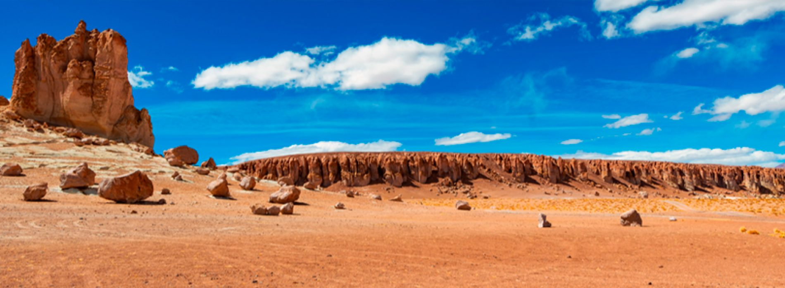
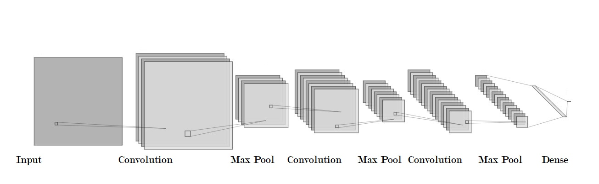
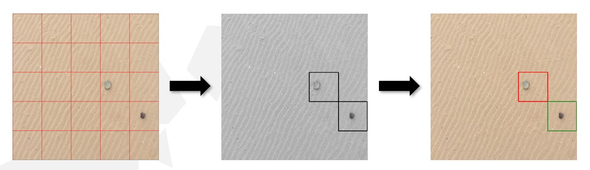

# METEORITE IDENTIFICATION FROM DRONE OBTAINED IMAGES

  
Meteorites are rocks that come from **outer space**. Studying them is a significant task, as they provide a better understanding about the past of the universe and also provide valuable information about planet compositions and the extraterrestrial resources available for future use. However, recovering fallen meteorites is a crucial step in studying them, but nowadays it is a slow and **tedious task**. This project seeks to find a way to fasten this process by identifying meteorites from aerial footage taken with drones. The data obtained goes through a recognition algorithm, which is created using **Deep Learning** architectures. 

  

## DATASET

One of the biggest problems we encountered while working on these project was the dataset, as it was a very **specific task** and there were not datasets available online. Hence, a dataset was created from sratch using different approaches:

- Using a **private collection** of meteorites: photographies were taken of them in different backgrounds, taking into account the characteristics of the places were this meterorites are to be found, the *Atacama Desert*.
- **Internet**: appropriate images were searched online. We took into account the background as well as the angle, because they should be from a cenital point of view, as if they were taken with a drone.
- **Image manipulation software**: images from backgraounds and meteorites were croped and added together accurately, taking into account factors such as light direction, exposure or grain, so that an artificial contrasts does not trick the model.

## MODEL ARCHITECTURE

The model's architecture has been inspired by the **VGG architecture**, created by Oxford researchers:

  

The architcture creation underwent **various changes** until the final one was decided: 

We first started by using only one model which detected the meteorites, but when exploring the results, concretely the **False Positives/Negatives**, we soon realized that model starts struggling when detecting meteorites so it starts by classifying the vast majority of difficult images as meteorites: 

Hence, it was deciced to work with **two different architectures** in series, one for detecting the candidates and another another one for classifying those into **rocks or meteorites**. These new approach yield much better overall results.

  

